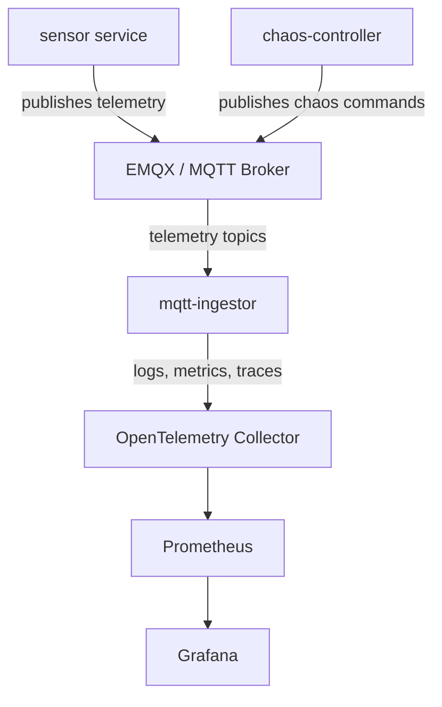
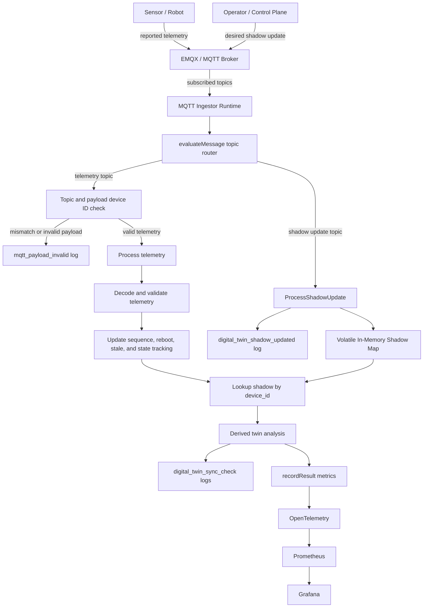

# Architecture

The hardware simulator generates synthetic device behavior and sends hardware
telemetry into the shared observability platform.

This architecture focuses on the simulator services, MQTT data paths,
hardware-specific telemetry signals, and the minimal digital twin prototype.

## Services



### `sensor`

Publishes synthetic hardware telemetry to MQTT. It can emulate thermal spikes,
signal loss, brownouts, memory leaks, slow loops, sleep mode, malformed payloads,
and sequence gaps.

### `chaos-controller`

Discovers sensor pods in Kubernetes and publishes chaos commands to MQTT topics
so the fleet can simulate faults.

### `mqtt-ingestor`

Consumes hardware telemetry from MQTT, validates the payload contract, detects
staleness and sequence anomalies, and exports metrics, logs, and traces through
OpenTelemetry.

## Telemetry Boundary

This repo keeps its own `internal/telemetry` package instead of depending on
private code from `observability-hub`.

The services are expected to export to the shared OpenTelemetry endpoint using
`OTEL_EXPORTER_OTLP_ENDPOINT`. Current Kubernetes manifests point to:

```text
opentelemetry.observability.svc.cluster.local:4317
```

As long as metric names, labels, and resource attributes remain stable, the
shared Grafana dashboards can continue to work even though the hardware code now
lives in a separate repository.

## Digital Twin Prototype

The digital twin prototype compares what a device reports with what the control
plane wants for that device.

The current version is intentionally small:

- Reported state comes from telemetry.
- Desired state comes from shadow updates.
- The MQTT ingestor keeps desired state in memory.
- The MQTT ingestor derives drift, match status, and sync status.
- OpenTelemetry, Prometheus, Grafana, and logs provide the UI for the twin.

Shadow state is volatile. Restarting the MQTT ingestor clears desired state until
a database-backed version is implemented.

### Data Flow



### Topics

| Topic | Meaning |
| :--- | :--- |
| `devices/{device_id}/telemetry` | Reported state from a specific device. |
| `devices/{device_id}/shadow/update` | Desired state for a specific device. |
| `sensors/thermal` | Legacy simulator telemetry topic. |

For per-device telemetry topics, the topic device ID must match the payload
`device_id`. A mismatch is rejected before processor state is updated.

### State Model

Reported state includes telemetry such as:

- `temperature`
- `voltage`
- `current`
- `power_usage`
- `device_state`
- `firmware_version`
- `uptime_seconds`
- `reboot_reason`

Desired shadow state currently supports:

- `temperature`
- `voltage`
- `device_state`
- `firmware_version`

Derived twin state includes:

- numeric drift for `temperature` and `voltage`
- match status for `device_state` and `firmware_version`
- overall sync status: `unknown`, `in_sync`, or `out_of_sync`

### Observability Output

The ingestor emits these digital twin log events:

- `digital_twin_shadow_updated`
- `digital_twin_sync_check`

The ingestor records these metrics:

- `hardware.shadow.drift`
- `hardware.shadow.status_match`

Both metrics include:

- `environment`
- `device_id`
- `property`
