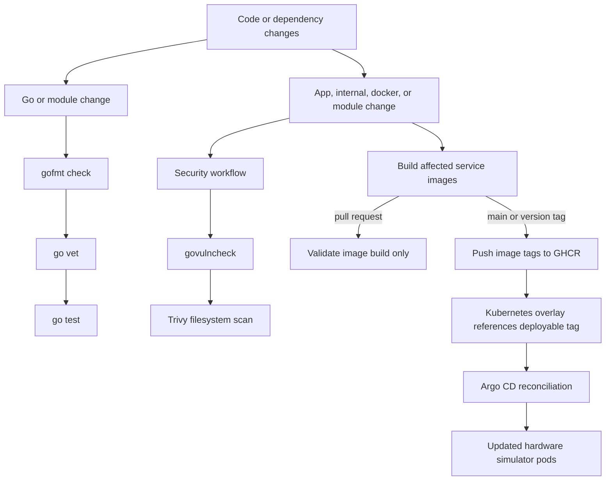

# Deployment

This repo provides the hardware simulator workloads and image build pipeline.
`observability-hub` owns the GitOps control plane. Argo CD is responsible for
reconciling the selected Kubernetes overlay and rolling updated images out to the
running pods.

## Deployment Flow

## CI

Continuous integration validates code quality, security, and image buildability
before deployment.

The CI path is handled by:

- `.github/workflows/ci.yml`
- `.github/workflows/security.yml`
- `.github/workflows/docker-build.yml`

Pull requests validate code, security, and image builds without publishing
images.

## CD

Continuous deployment starts when deployable images are published and the GitOps
platform reconciles the Kubernetes overlay.

On `main`, `.github/workflows/docker-build.yml` builds changed service images and
pushes deployable tags to GHCR. Version tags and manual full runs build every
service image.

The workflow only builds services affected by the changed paths unless a full
build is requested.

The deployable manifests live under `k3s/`:

- `k3s/base/`: shared workload and RBAC definitions
- `k3s/overlays/dev/`: development overlay
- `k3s/overlays/prod/`: production-style overlay

The overlays define which image tag should run for each simulator service. Argo
CD applies the selected overlay and updates the Kubernetes workloads when the
desired image state changes.

This repo stops at producing images and Kubernetes manifests. The higher-level
CD loop belongs to `observability-hub`:

1. this repo builds and publishes simulator images
2. this repo exposes deployable `k3s` overlays
3. `observability-hub` points Argo CD at the selected overlay
4. Argo CD updates the hardware simulator pods in the cluster
